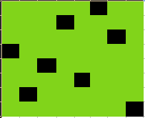
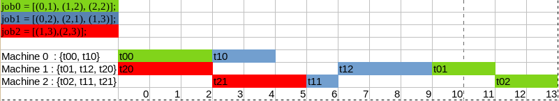
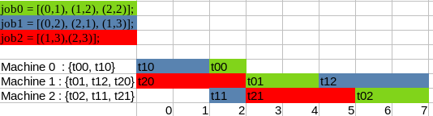

# Problème en SMT

## Couleur

        Pour cet exercice nous avons déclaré un datatype avec les couleurs. Nous disposons aussi pour chaque ville une variable de type client.

## Couleur2

        Question 2 de l'exercice couleur. Le résultat est unsat car le Luxembourg a 3 voisins. Il est donc impossible de colorer les 3 voisins + le Luxembourg de couleurs différents 2 à 2 avec 3 couleurs.

## Aviateur

        Pour cet exercice nous avons déclaré un datatype avec les clients. Nous disposons aussi pour chaque ville et chaque raison  une variable de type client.

## Aviateur raté

        Tentative d'implémenter l'exercice avec des tableaux mais cela n'a pas abouti.

## Les 8 reines

        Pour cet exercice nous avons déclaré 8 variables portant le nom de l'indice de colonne d'un échiquer.

        Nous disposons dans cet exercice de 3 fonctions:

        -   La premère fonction "letter" prend en paramètre un indice compris entre 1 et 8 et renvoie la lettre correspondante (selon un ordre alphabétique).

        - La seconde fonction "index" prend en paramètre une lettre comprise entre a et h et renvoie la position correspondante (selon un ordre alphabétique).

        - La troisième fonction vérifie que la reine ne possède pas d'obstable sur ses diagonales.



## ordonnancement

        Chaque tâches dispose de sa variable.
        Nous gérons l'ordre des tâches au sein des jobs.
        Puis nous gérons l'ordre des taches dans les différentes machines.
        -> Le premier résultat était correct, mais nous observions de nombreux moments ou le process était inactif.



        -> Nous avons utilisé la fonction minimize() de z3 afin de "demander" à z3 de chercher une optimisation de l'ordonnancement.




## Enigme «d'Einstein»

        Pour cet exercice nous avons déclaré un datatype avec les nationnalités des 5 individus. Nous disposons aussi pour chaque animal, boisson, marque de cigar, couleur de maison et numéro de maison une variable de type nationnalité.

        Nous disposons également dans cet exercice de 2 fonctions:
        
        -   La première "Left" prend en argument une nationalité et retourne la maison situé à gauche de celle de la nationalité indiqué.

        -   La seconde "Right" prend en argument une nationalité et retourne la maison situé à droite de celle de la nationalité indiqué.


|                  | Maison 1  | Maison 2 | Maison 3   | Maison 4 | Maison 5    |
| ---------------- | --------- | -------- | ---------- | -------- | ----------- |
| **Couleur**      | Jaune     | Bleu     | Rouge      | Vert     | Blanc       |
| **Nationnalité** | Norvégien | Dannois  | Britanique | Allemand | Suedois     |
| **Boissons**     | Eau       | The      | Lait       | Café     | Biere       |
| **Cigarette**    | Dunhill   | Blend    | PallMall   | Prince   | Blue Master |
| **Animal**       | Chat      | Cheval   | Oiseau     | Poisson  | Chien       |


# Résultats :

## Couleurs
```
sat
(model 
  (define-fun D () Color Blue)
  (define-fun S () Color Green)
  (define-fun N () Color Red)
  (define-fun I () Color Blue)
  (define-fun B () Color Green)
  (define-fun F () Color Red)
  (define-fun E () Color Green)
)
```
## Couleurs avec Luxembourg 

unsat

## Aviateur
```
sat
(model 
  (define-fun   Idylle ()     Clients Xing)
  (define-fun   Kart ()       Clients Young)
  (define-fun   Jeu ()        Clients Wood)
  (define-fun   Cincinatti () Clients Young)
  (define-fun   Loisir ()     Clients Underwood)
  (define-fun   Fargo ()      Clients Zellman)
  (define-fun   Marriage ()   Clients Zellman)
  (define-fun   Albany ()     Clients Underwood)
  (define-fun   Detroit ()    Clients Vanderkook)
  (define-fun   Halloween ()  Clients Vanderkook)
  (define-fun   Birmingham () Clients Wood)
  (define-fun   ElPaso ()     Clients Xing)
)
```

## 8 reines
```
sat
(model 
  (define-fun a () Int 6)  (1,6)
  (define-fun b () Int 4)  (2,4)
  (define-fun c () Int 7)  (3,7)
  (define-fun d () Int 1)  (4,1)
  (define-fun e () Int 3)  (5,3)
  (define-fun f () Int 5)  (6,5)
  (define-fun g () Int 2)  (7,2)
  (define-fun h () Int 8)  (8,8)
)
```

## Ordonnancement

### Sans optimisation
```
sat
(model 
  (define-fun t00 () Int 0)
  (define-fun t02 () Int 12)
  (define-fun t12 () Int 7)
  (define-fun t20 () Int 0)
  (define-fun t11 () Int 6)
  (define-fun t21 () Int 3)
  (define-fun t01 () Int 10)
  (define-fun t10 () Int 3)
)
```

### Avec optimisation
```
(+ t00 t01 t02 t10 t11 t12 t20 t21) |-> 21
sat
(model 
  (define-fun t00 () Int 2)
  (define-fun t02 () Int 6)
  (define-fun t12 () Int 5)
  (define-fun t20 () Int 0)
  (define-fun t11 () Int 2)
  (define-fun t21 () Int 3)
  (define-fun t01 () Int 3)
  (define-fun t10 () Int 0)
)
```

## Einstein
```
sat
(model 
  (define-fun Dunhill () Nationality Norwegian)
  (define-fun Blue () Nationality Dane)
  (define-fun Dogs () Nationality Swede)
  (define-fun Coffe () Nationality German)
  (define-fun PallMall () Nationality Brit)
  (define-fun White () Nationality Swede)
  (define-fun Beer () Nationality Swede)
  (define-fun Blend () Nationality Dane)
  (define-fun Green () Nationality German)
  (define-fun Cats () Nationality Norwegian)
  (define-fun BlueMaster () Nationality Swede)
  (define-fun Horses () Nationality Dane)
  (define-fun Prince () Nationality German)
  (define-fun HouseFive () Nationality Swede)
  (define-fun Yellow () Nationality Norwegian)
  (define-fun HouseThree () Nationality Brit)
  (define-fun Birds () Nationality Brit)
  (define-fun Fish () Nationality German)
  (define-fun HouseTwo () Nationality Dane)
  (define-fun Milk () Nationality Brit)
  (define-fun HouseOne () Nationality Norwegian)
  (define-fun HouseFour () Nationality German)
  (define-fun Tea () Nationality Dane)
  (define-fun Red () Nationality Brit)
  (define-fun Water () Nationality Norwegian)
)
```